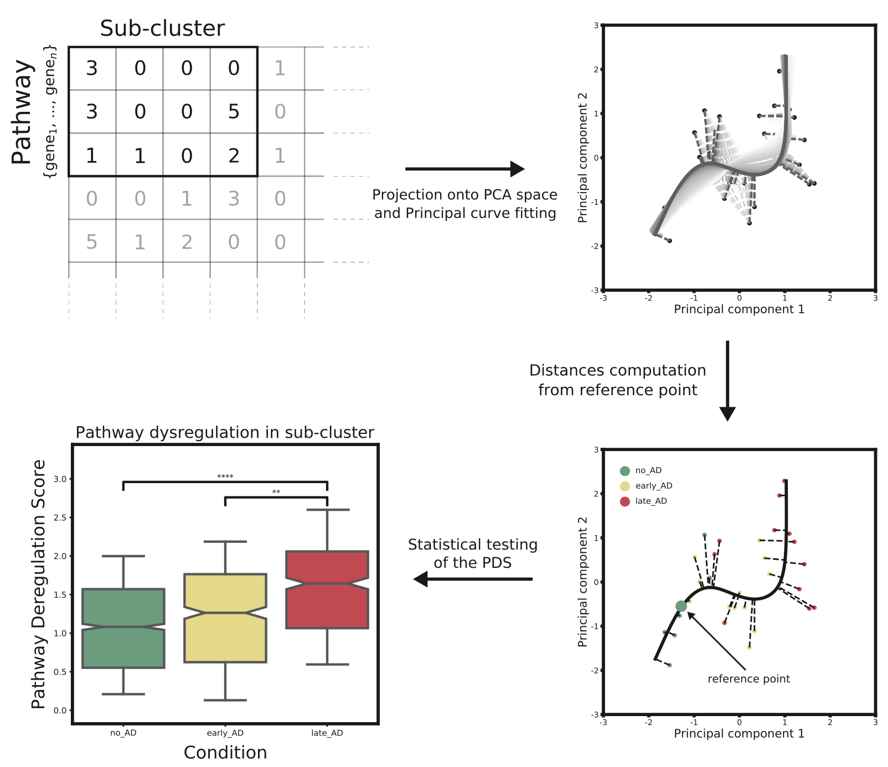

# Bioinformatics personal repository

**disclaimer**: this is a general repository with some unspecific structure. It represents a work in progress!

This repository contains a collection of bioinformatics functions used to analyse bulk/single-cell transcriptomics data.  
Some of the scripts require `rpy2 v.2.9.4` - [found here](https://rpy2.github.io) - to run.  
The `default_env.yml` contains all the libraries needed to create the environment.

The `src` folder contains all the relevant scripts/functions where:
- `network` contains network analysis methods to study co-expression networks (_motifs detection_, _clustering coefficient_, etc...)
* `bioinfo` contains general methods for differential expression, pathway enrichment analysis, and other methods
    - `run_pathifier` function is a Python implementation of the _Pathifier_ ([download here](http://www.bioconductor.org/packages/release/bioc/html/pathifier.html))
      method developed by [Drier et al.](https://www.pnas.org/content/110/16/6388).
      This method allows to compress gene-based info into pathway-based info.  
      This implementation allows to choose between the original method and the [_PathTracer_](https://www.nature.com/articles/s41598-019-52529-3) method.  
      Also, this is a modified version of both: the optimal number of PCs to use for the _Principal Curve_ computation is given by a permutation test on the components:   
      &nbsp;&nbsp; - see `my_PCA.select_components_above_background` for reference.  
      &nbsp;&nbsp; - an example of the pipeline is given in the module `pathifier_example_structure.py`.  
      &nbsp;&nbsp;&nbsp;&nbsp;This is specific to a dataset, but can be generalised - planning to do so with time.  
      

      
      
      

      
* `data_viz` contains custom visualization tools to attach heatmaps to dendgrograms, explore pathway enrichment, UMAP plots
* `statistics` contains standard statistical tests, both for stats and ML, together with fitting functions, etc...
      

The `example` directory contains some output files generated with the scripts contained in this repository.  

The `repos` directory contains some repository with standard bioinformatic annotation databases (**disclaimer!** they could be outdated):
* recommend using [goatools](https://github.com/tanghaibao/goatools) in combination with some of the most useful python libraries for bioinformatics listed below:
    * [anndata](https://anndata.readthedocs.io/en/latest/anndata.AnnData.html)
    * [scanpy](https://scanpy.readthedocs.io/en/stable/)
    * [biopython](https://biopython.org)
